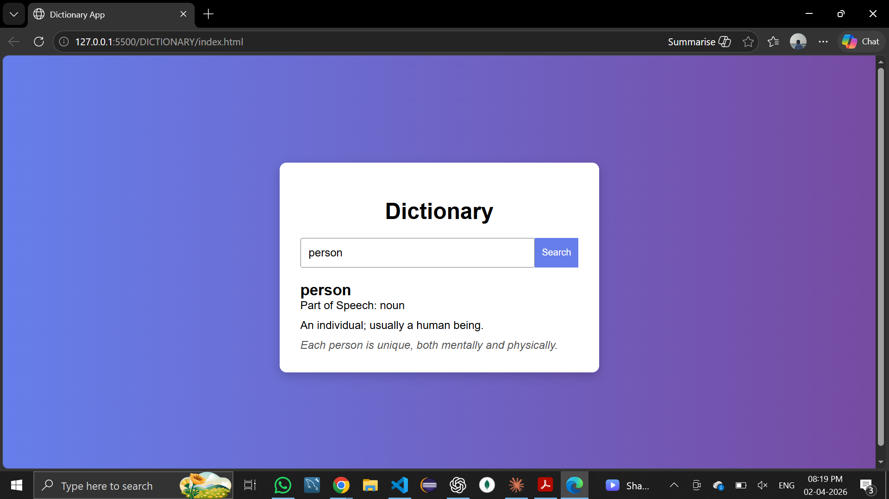

#  Online Dictionary Web App

A simple and interactive web-based dictionary application that allows users to search for word meanings, definitions, and usage examples.

##  Live Demo
https://yogarajc77.github.io/online-dictionary-web-app/

##  Screenshots

##  Tech Stack

- HTML5
- CSS3
- JavaScript (Vanilla JS)

##  Features

-  Search any English word
-  Displays meaning and definition
-  Fast and responsive UI
-  Simple and user-friendly design

##  Project Structure

DICTIONARY:
1.index.html
2.style.css
3.script.js

